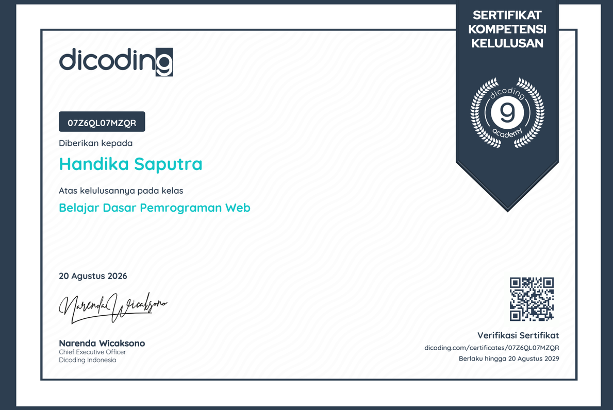
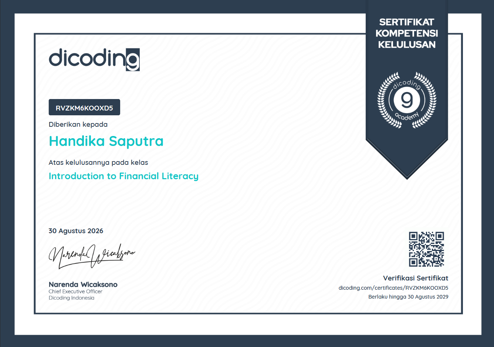
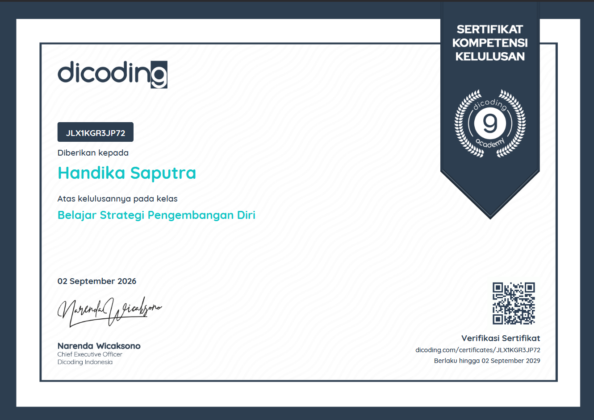
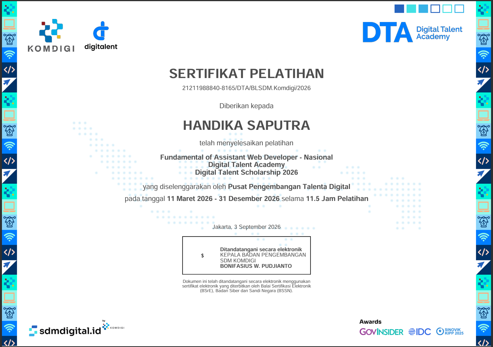
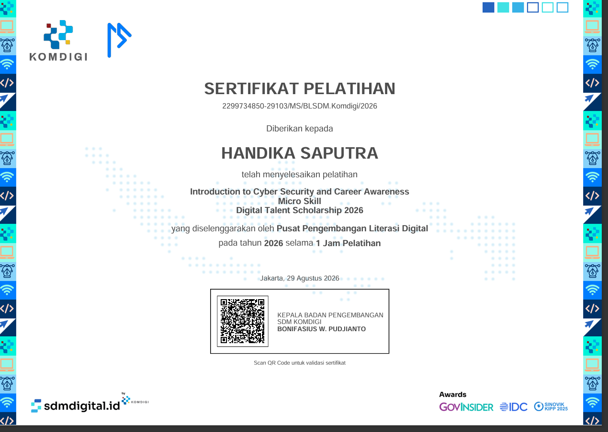

- I’m currently learning Language **JavaScript**

<h2>Language and tools</h2>

 

<h2 align="center">Academic & Research Profiles</h2>

  
  &nbsp;&nbsp;&nbsp;
  
  &nbsp;&nbsp;&nbsp;
  
  &nbsp;&nbsp;&nbsp;
  

 

## Artificial Intelligence

 

## Education

  

<h2>Basic certification</h2>

| Nama Sertifikat                                                     | Penerbit                            | Link Verifikasi                                                                                   | Preview |
|---------------------------------------------------------------------|-------------------------------------|---------------------------------------------------------------------------------------------------|---------|
| **Dasar Pemrograman Web**                                           | Dicoding                            | [Verifikasi](https://www.dicoding.com/certificates/07Z6QL07MZQR)                                  |         |
| **Introduction to Financial Literac**                               | Dicoding                            | [Verifikasi](dicoding.com/certificates/RVZKM6KOOXD5)                                              |         |
| **Strategi Pengembangan Diri**                                      | Dicoding                            | [Verifikasi](dicoding.com/certificates/JLX1KGR3JP72)                                              |         |
| **Fundamental of Assistant Web Developer - Nasional 2026**          | Pusat Pengembangan Talenta Digital  | [Verfikasi](https://digitalent.komdigi.go.id/cek-sertifikat#)  Nomor Sertifikat: 21211988840-8165 |         |
| **Introduction to Cyber Security and Career Awareness Micro Skill** | Pusat Pengembangan Literasi Digital | [Verifikasi](https://digitalent.komdigi.go.id/cek-sertifikat?registrasi=2299734850-29103)         |         |
| **Intro to Programming**                                            | Kaggle                              | [Verifikasi](https://www.kaggle.com/learn/certification/handikaaaputra/intro-to-programming)      |         |
| **Python**                                                          | Kaggle                              | [Verifikasi](https://www.kaggle.com/learn/certification/handikaaaputra/python)                    |         |

  

<h2>My Github Stats</h2>

